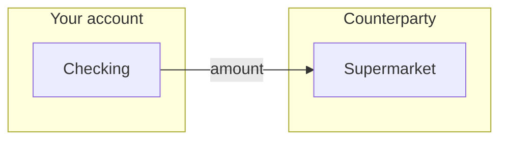
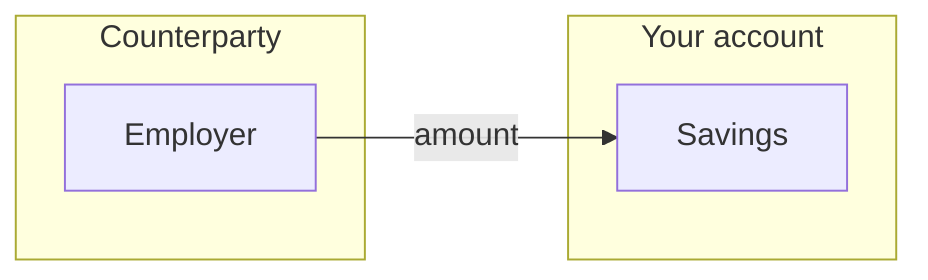
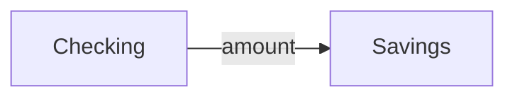

# Transaction form redesign

Design and implementation plan for the **New Transaction** screen (`TransactionFormScreen` / `TransactionFormViewModel`). Goal: a clearer, more attractive flow that matches how people think about money (income, spending, transfers) while keeping Pledger’s account-type rules intact.

**Status:** Phase 1–3 implemented (templates, tags; split/receipt deferred — see Phase 3)  
**Related:** [Architecture — transaction create form](ARCHITECTURE.md#transaction-create-form), [Account types](ACCOUNTS.md)

---

## 1. Current state

### What works today

- Correct **Pledger semantics** per type (owned vs creditor/debtor) via `AccountInputKind` and API search.
- **Debounced counterparty search** (`FilterAutocompleteField`) and **owned-account dropdown**.
- Validation and create via `POST /v2/api/transactions`.
- Consistent **PledgerTopBar** and Material 3 theme (emerald accent, income green / expense red elsewhere in the app).

### Pain points (UX)

| Issue | Why it hurts |
|--------|----------------|
| **Flat field list** | Description → amount → date → type → accounts feels like a database form, not “record a payment”. |
| **Type selector in the middle** | User must scroll past unrelated fields before the form adapts; type should drive the whole layout. |
| **Generic “From / To” labels** | For income, “from debtor → to my account” is correct in the API but confusing in the UI. |
| **Manual date string** | `YYYY-MM-DD` in a text field is error-prone; no calendar or “today” shortcut beyond default. |
| **Amount not prominent** | The main numeric input looks like any other `OutlinedTextField`. |
| **Type change wipes accounts** | Switching Income ↔ Expense clears both sides; users lose work. |
| **Currency at the bottom** | Often same as account currency; feels disconnected from amount. |
| **No visual money flow** | Lists don’t show direction (in / out / between wallets). |
| **No account icons** | Dropdowns are text-only; detail/list screens already use `AccountIcon`. |
| **Single scroll + bottom button** | Save is easy to miss; no sticky CTA or progress sense. |

### Current field order (reference)

```
Description → Amount → Date (text) → Type chips → From * → To * → Currency → [Create]
```

### Account mapping (unchanged in redesign)

| UI label (today) | API type | From (`source`) | To (`destination`) |
|------------------|----------|-----------------|---------------------|
| Income | `DEBIT` | Debtor (autocomplete) | Owned (dropdown) |
| Expense | `CREDIT` | Owned (dropdown) | Creditor (autocomplete) |
| Transfer | `TRANSFER` | Owned (dropdown) | Owned (dropdown) |

---

## 2. Design principles

1. **Type first** — Choosing income / expense / transfer restructures labels, hints, and icons immediately.
2. **Show the flow** — One “money path” card: who → where, with arrows and plain language.
3. **Amount is the hero** — Large typographic amount + inline currency; date secondary.
4. **Progressive disclosure** — Required path is short; description and advanced fields grouped below.
5. **Preserve context** — When changing type, keep accounts that still fit the same role (owned vs counterparty).
6. **Reuse app patterns** — `PledgerCard`, `PledgerTopBar`, `FilterChip`, `AccountIcon`, theme colors (`IncomeGreen`, `ExpenseRed`, `EmeraldGreen`).
7. **Same API contract** — No backend changes required for v1; optional category/expense later.

---

## 3. Proposed layout

### 3.1 Screen structure (top → bottom)

```
┌─────────────────────────────────────────┐
│  PledgerTopBar: "New transaction"       │
├─────────────────────────────────────────┤
│  [ Income ] [ Expense ] [ Transfer ]    │  ← segmented control, full width
│  (icons + subtle color when selected)   │
├─────────────────────────────────────────┤
│  ┌─ Amount card (PledgerCard) ────────┐ │
│  │  €  123,45          [ EUR ▾ ]      │ │  ← large amount, currency chip
│  │  [ Today ] [ Yesterday ] [ Pick ]  │ │  ← date chips + date picker
│  └────────────────────────────────────┘ │
├─────────────────────────────────────────┤
│  ┌─ Money flow card ──────────────────┐ │
│  │  Paid from          →    To        │ │  ← labels change per type
│  │  [ Checking ▾ ]          [ Shop…]  │ │
│  │  (icons in rows)                   │ │
│  └────────────────────────────────────┘ │
├─────────────────────────────────────────┤
│  Description (optional feel, still req) │
│  ── More options (collapsed) ──         │  ← phase 2: category, tags
├─────────────────────────────────────────┤
│  [ Create transaction ]  (sticky)       │
└─────────────────────────────────────────┘
```

### 3.2 Type selector (segmented control)

Replace three small `FilterChip`s with a **single-row segmented control** (or three equal `Surface` cards):

| Type | Icon | Selected accent | Subtitle (optional) |
|------|------|-----------------|---------------------|
| Income | `TrendingUp` / arrow down to wallet | `IncomeGreen` border or tint | “Money in” |
| Expense | `TrendingDown` / cart | `ExpenseRed` | “Money out” |
| Transfer | `SwapHoriz` | `EmeraldGreen` | “Between your accounts” |

- Animate content cross-fade when type changes (200ms).
- Subtitle under bar updates: e.g. “Record money you received”.

### 3.3 Amount & date card

- **Amount:** `BasicTextField` or `OutlinedTextField` with `headlineMedium` / `displaySmall` styling; decimal keyboard; optional thousands separator on blur (display only).
- **Currency:** Trailing **filter chip** or compact dropdown (reuse currency list from ViewModel); default from selected owned account when one side is picked.
- **Date:**
  - **Phase 1:** Material 3 `DatePicker` in dialog (`rememberDatePickerState`); field shows formatted date (`15 May 2026`), not raw ISO.
  - Quick actions: **Today**, **Yesterday** chips set `LocalDate` without opening picker.

### 3.4 Money flow card (core UX improvement)

One `PledgerCard` with a horizontal **flow diagram**:

```text
Expense:   [ Owned account ▾ ]  ──→  [ Search payee… ]
Income:    [ Search payer… ]     ──→  [ Owned account ▾ ]
Transfer:  [ From account ▾ ]    ──→  [ To account ▾ ]
```

**Contextual labels** (not generic From/To):

| Type | Left label | Right label | Left control | Right control |
|------|------------|-------------|--------------|---------------|
| Expense | Paid from | To (payee) | Owned dropdown | Creditor autocomplete |
| Income | Received from | Deposited to | Debtor autocomplete | Owned dropdown |
| Transfer | From | To | Owned dropdown | Owned dropdown |

- Center: arrow icon (`ArrowForward`) in `onSurfaceVariant`.
- Each side: optional **AccountIcon** + name when selected; empty state shows placeholder (“Choose account”, “Search party…”).
- Helper line under card (one sentence): e.g. “Money leaves your checking account and is recorded against this creditor.”

### 3.5 Description & advanced section

- **Description:** Moved below flow card; single line default, expandable to 2–3 lines; label “What was this for?” with examples in placeholder (“Groceries, salary, rent”).
- **More options (collapsed):** Phase 2 — category, budget/expense, contract (API already used on list filters). Keeps v1 simple.

### 3.6 Primary action

- **Sticky bottom bar** (like many banking apps): full-width filled button “Create transaction”, disabled until `canSubmit`; shows inline validation summary above button when tapped while invalid (“Choose payee”, “Enter amount”).
- Top **linear progress** only while saving (keep current behavior).

---

## 4. Interaction details

### 4.1 Changing transaction type

**Today:** All account selections cleared.

**Proposed:** Role-based preservation:

```kotlin
// Pseudologic in onTypeChanged
preserve source if newSourceKind == oldSourceKind
preserve target if newTargetKind == oldTargetKind
// OWNED_DROPDOWN ↔ OWNED_DROPDOWN: keep same account id if still in ownedAccounts
// Autocomplete ↔ Autocomplete: keep only if same counterparty type (creditor vs debtor)
```

If preserved account is invalid, clear that side only.

### 4.2 Counterparty search

- Keep `FilterAutocompleteField`; embed inside flow card row (compact).
- Show **“Create new party”** row in suggestions (Phase 2 → navigate to `AddAccount` with `type=creditor|debtor`).
- Minimum 2 characters before search (optional) to reduce noise for large party lists.

### 4.3 Owned account dropdown

- Replace plain dropdown with **bottom sheet** or searchable list when account count > 8.
- Show **balance** (muted) next to name for disambiguation.
- Show **AccountIcon** when `iconFileCode` present.

### 4.4 Validation feedback

- Field-level errors (red outline) instead of one banner at top.
- `canSubmit` false → sticky button disabled; on click, scroll to first invalid section.

### 4.5 Defaults

| Field | Default |
|--------|---------|
| Type | Expense (common case) or last-used (DataStore, Phase 2) |
| Date | Today |
| Currency | User display currency from settings, else EUR |
| Amount | Empty (no 0.00 prefill) |

---

## 5. Visual design tokens

Reuse existing theme; extend only where needed.

| Element | Token |
|---------|--------|
| Income selected | `IncomeGreen` background 12% alpha |
| Expense selected | `ExpenseRed` background 12% alpha |
| Transfer selected | `EmeraldGreen` background 12% alpha |
| Flow card | `PledgerCard` + 16.dp padding |
| Amount text | `MaterialTheme.typography.displaySmall` |
| Section title | `labelLarge` + `onSurfaceVariant` |

**Do not** rely on color alone for type (icons + labels for accessibility).

---

## 6. Architecture & files

### 6.1 New / refactored composables

| Component | Responsibility |
|-----------|----------------|
| `TransactionTypeSelector` | Segmented income / expense / transfer |
| `TransactionAmountCard` | Amount, currency, date shortcuts + picker |
| `TransactionFlowCard` | Contextual labels + two account slots |
| `TransactionAccountSlot` | Wraps dropdown vs autocomplete + icon |
| `TransactionFormFooter` | Sticky submit + validation summary |

Keep `TransactionFormViewModel` as single source of truth; add:

- `sourceLabel` / `targetLabel` (computed from `TransactionType`)
- `flowHelperText` (computed)
- `formattedDate` + `onDatePickerResult`
- `preserveAccountsOnTypeChange(oldType, newType)` logic

### 6.2 ViewModel state additions (suggested)

```kotlin
data class TransactionFormUiState(
  // existing fields…
  val showDatePicker: Boolean = false,
  val fieldErrors: TransactionFormFieldErrors = TransactionFormFieldErrors(),
)

data class TransactionFormFieldErrors(
  val amount: String? = null,
  val source: String? = null,
  val target: String? = null,
  val date: String? = null,
  val description: String? = null,
)
```

### 6.3 Dependencies

- **Phase 1:** Compose Material3 `DatePicker` (already on BOM).
- **Phase 2:** `UserPreferences` for last type/currency; navigation to add account.

### 6.4 Testing

Extend unit tests:

- Label/helper text per `TransactionType`
- Account preservation when switching Expense → Transfer (owned → owned)
- Clear counterparty when switching Expense → Income
- Date parsing via picker state, not free text

---

## 7. Implementation phases

### Phase 1 — Core redesign (MVP)

**Goal:** Ship improved layout without new API fields.

| Task | Effort |
|------|--------|
| Extract composables from `TransactionFormScreen` | S |
| Type-first segmented selector + flow card labels | M |
| Amount hero + date picker + Today/Yesterday | M |
| Sticky submit + field errors | S |
| Account preservation on type change | M |
| Account icons in owned picker | S |

**Acceptance criteria**

- User can create income, expense, and transfer without reading API docs.
- No regression in `TransactionFormViewModel` save payload.
- TalkBack reads “Paid from” / “Deposited to” correctly per type.

### Phase 2 — Polish ✅

| Task | Effort |
|------|--------|
| Bottom sheet for owned accounts (search + balance) | M |
| “Add new party” from creditor/debtor search | M |
| Remember last transaction type (DataStore) | S |
| Collapsible “More options” (category, etc.) | L |
| Edit transaction (reuse form, prefill) | L |

### Phase 3 — Optional ✅ (partial)

| Task | Status |
|------|--------|
| Template transactions (local DataStore, apply + save) | ✅ |
| Tags on create/edit (`POST` / `PUT` tags field) | ✅ |
| Split bill (PATCH on existing transaction) | ✅ |
| Photo/receipt attachment | ⏸ No file upload endpoint in client |

---

## 8. Flow diagrams

### Expense (money out)



### Income (money in)



### Transfer



---

## 9. Out of scope (v1)

- Editing existing transactions from detail screen (listed in README as planned).
- Multi-currency FX conversion UI.
- Split transactions across categories.

---

## 10. Success metrics

Qualitative (user testing):

- Time to complete first expense &lt; 30 seconds with one owned + one creditor account.
- Users correctly identify which side is “their account” without help.

Technical:

- All existing `TransactionFormViewModel` integration tests still pass or are updated.
- No increase in failed creates due to date format errors (picker eliminates free-text dates).

---

## 11. References

- Current UI: `app/src/main/java/com/pledgerio/app/ui/transactions/TransactionFormScreen.kt`
- Logic: `TransactionFormViewModel.kt`, `AccountInputKind`
- Shared autocomplete: `FilterAutocompleteField.kt`
- Web product copy: [Pledger — accounts](https://www.pledger.io/how-to/your-finances/accounts.html)
